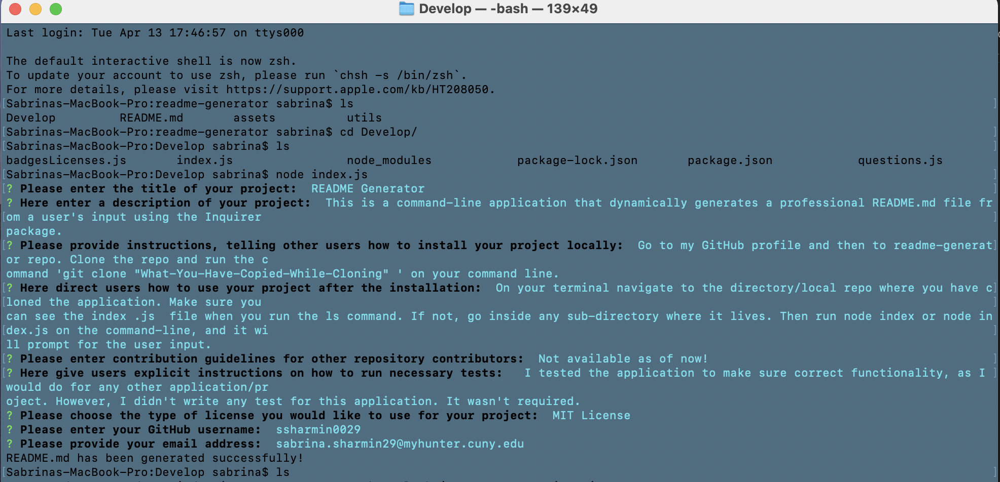

# readme-generator

## Screenshot

## Description 
This is a command-line application that dynamically generates a professional README.md file from a user's input using the Inquirer package. 

## Technologies Used:
- JavaScript 
- Node.js
- Inquirer package 
- Markdown 

## Demo-Link 
[readme-generator-demo](https://drive.google.com/file/d/1_PJ8f6p3fD_dS2rLqdGRdkZn-Ddjymtj/view?usp=sharing)